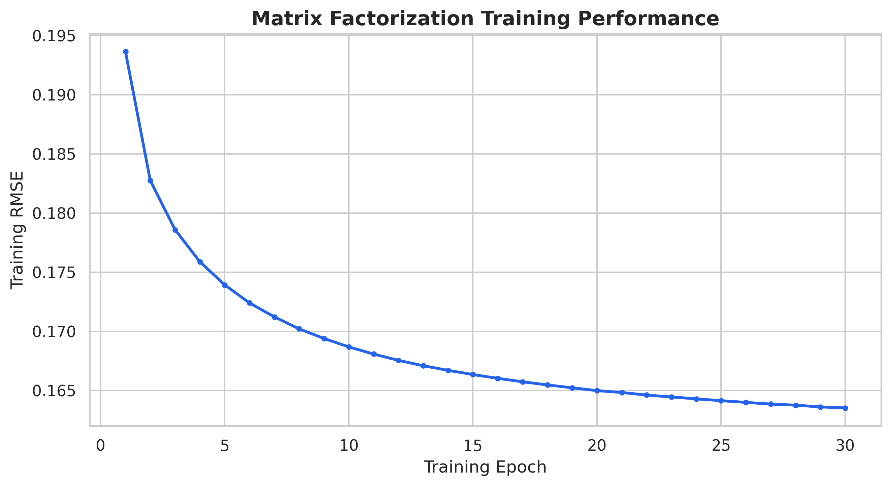
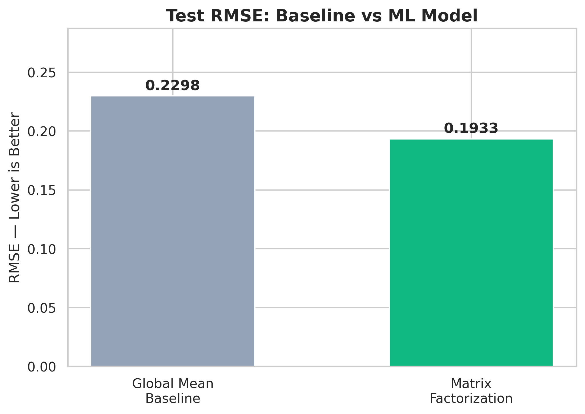
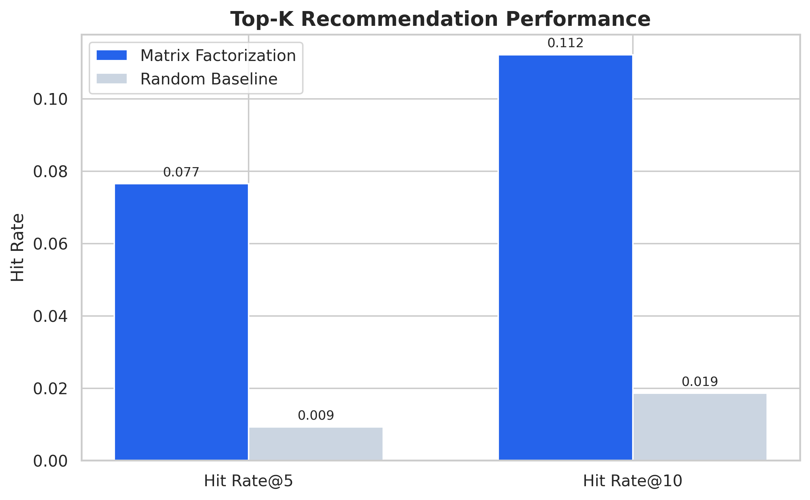
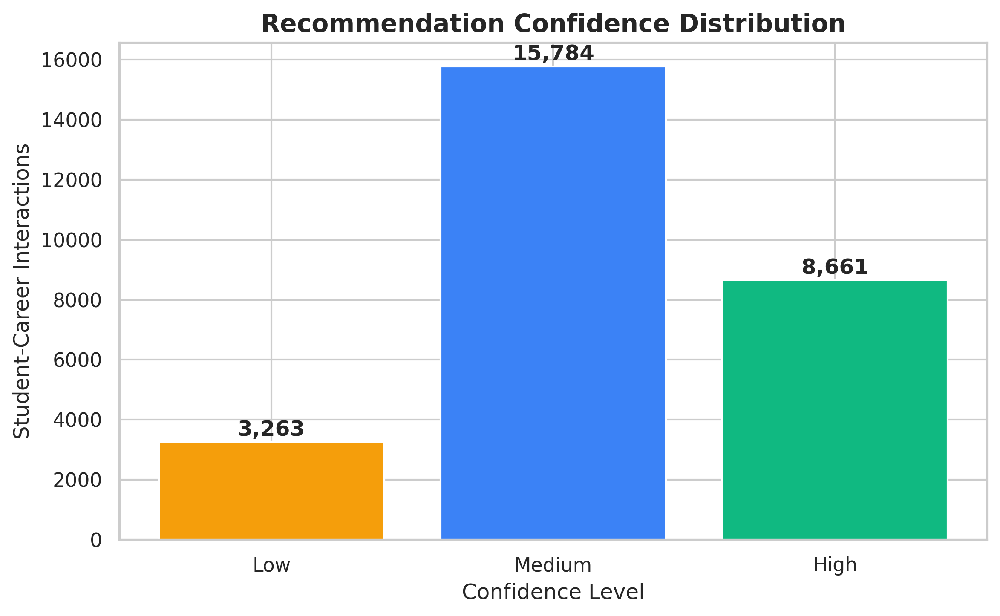

# AI-Powered Career Recommendation System

A privacy-aware hybrid ML system for personalized career recommendations.

## Project Highlights

- 43,371 valid student profiles analyzed
- 159,196 quiz activity records analyzed
- 24,259 Student-Career marks records
- 27,708 final Student-Career interactions
- 1,632 students with interaction history
- 548 verified career options
- 41,739 cold-start students supported
- Matrix Factorization collaborative filtering
- Grade and Gender cohort-based cold-start recommendations
- Bayesian smoothing for sparse quiz and cohort data

Raw datasets are excluded because they contain private student data.

## Model Performance

| Metric | Result |
|---|---:|
| Baseline RMSE | 0.2298 |
| Matrix Factorization RMSE | 0.1933 |
| Matrix Factorization MAE | 0.1397 |
| RMSE Improvement | 15.88% |
| Hit Rate@5 | 0.0765 |
| NDCG@5 | 0.0375 |
| Hit Rate@10 | 0.1122 |
| MRR@10 | 0.0298 |
| Random Hit Rate@5 | 0.0093 |
| Random Hit Rate@10 | 0.0186 |

The model achieved approximately 8.2x the random Hit Rate@5.

These are recommender-system metrics, not classification accuracy.

## Workflow

1. Data validation and Student ID standardization
2. Student and career coverage analysis
3. Log transformation of skewed career marks
4. Within-student marks normalization
5. Career-specific quiz aggregation
6. Bayesian smoothing of quiz accuracy
7. Availability-aware hybrid interaction score
8. Matrix Factorization using SGD
9. Top-K recommendation evaluation
10. Cohort-based cold-start recommendations

## Visual Results

### Training Curve

### Baseline vs ML Model

### Top-K Performance

### Confidence Distribution

## Technology Stack

- Python
- Pandas and NumPy
- Scikit-learn
- Matplotlib and Seaborn
- ipywidgets
- Google Colab

## Privacy and Responsible AI

- Original student data is not published.
- Public sample data is completely synthetic.
- Existing recommendation columns were excluded to prevent leakage.
- Only verified careers appear in final recommendations.
- Results support decision-making and do not replace career counselling.

## Future Improvements

- Add career descriptions and required skills
- Collect explicit student feedback
- Add recommendation diversity and fairness evaluation
- Use temporal validation
- Deploy using Streamlit or FastAPI

## Author

Kalyani Waghaye